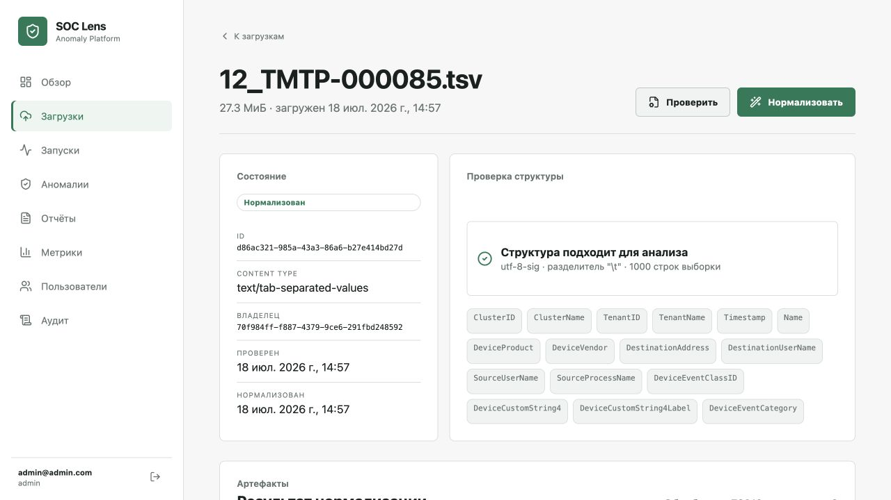
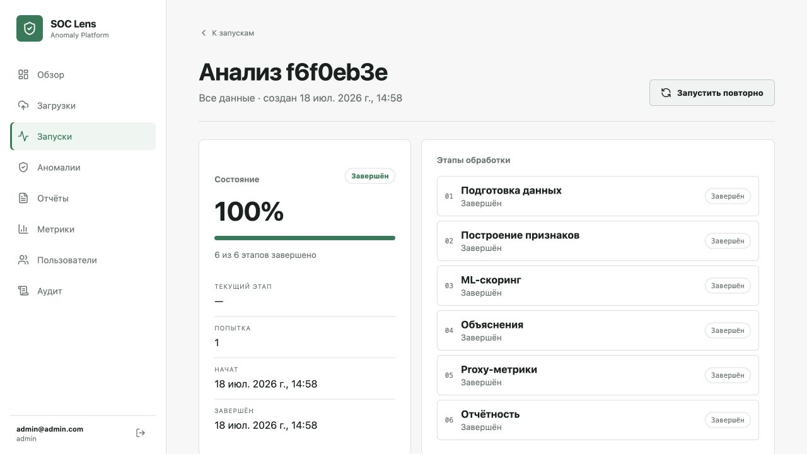
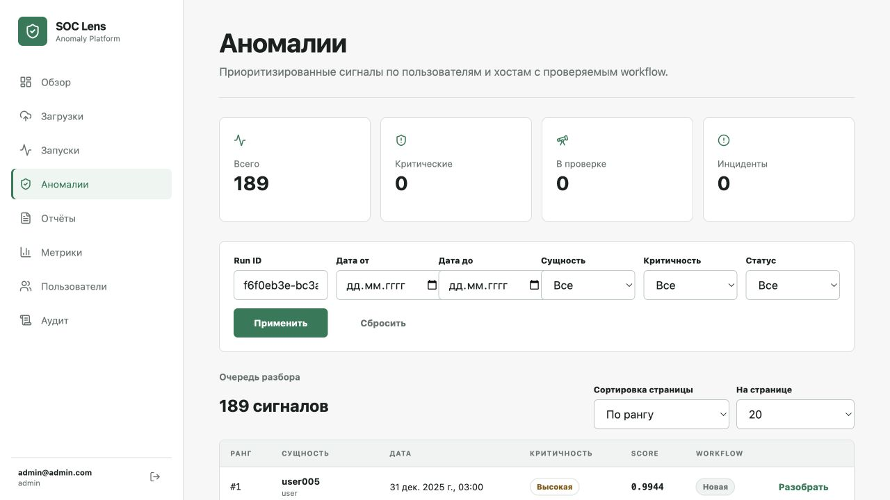
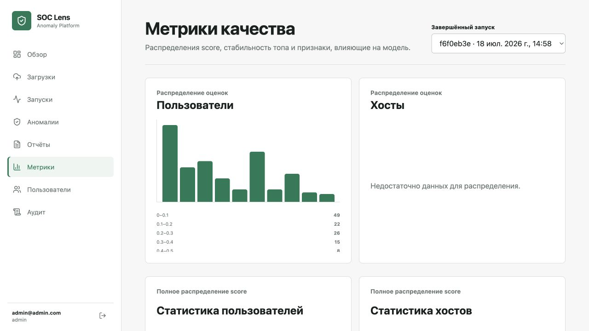

# SOC Anomaly Platform

Веб-приложение для автоматизации работы ИБ/SOC-специалиста.

## Цель

Загрузка SIEM/NGFW-логов, запуск ML-анализа, поиск аномалий пользователей и хостов, explainability и SOC-отчеты.

## Планируемые модули

- Data Ingestion
- Analysis Pipeline
- Analyst Workspace
- Reporting & Metrics
- Security & Operations

## Обработка входных логов

Backend принимает `.csv`, `.tsv` и `.txt` файлы и хранит историю их обработки.
Основные операции:

- `GET /uploads` — история загрузок с результатами проверки и нормализации;
- `POST /uploads/{file_id}/validate` — определение кодировки, разделителя и колонок;
- `POST /uploads/{file_id}/normalize` — формирование дневных SIEM/PAN CSV;
- `GET /uploads/{file_id}` — текущее состояние и ссылки на созданные артефакты.

Нормализация удаляет служебные tenant/cluster-поля, приводит время к единому формату,
анонимизирует пользователей и сохраняет отдельные файлы по датам. Каталоги входных
и нормализованных данных задаются переменными `UPLOAD_DIRECTORY` и
`NORMALIZED_DIRECTORY`.

## Локальный запуск платформы

Требования: Docker с Compose v2. Backend, PostgreSQL, Redis, RQ worker, миграции и
начальный администратор и Next.js frontend запускаются одной командой:

```bash
docker compose up --build
```

При первом запуске сервис `migrations` применяет все Alembic-миграции и создаёт
локального администратора. Значения по умолчанию предназначены только для локальной
разработки:

- email: `admin@admin.com`;
- password: `admin`.

Перед использованием общей среды скопируйте `.env.example` в `.env` и обязательно
замените `JWT_SECRET` и `INITIAL_ADMIN_PASSWORD`. Seed идемпотентен и не меняет
пароль уже существующего администратора.

После запуска доступны:

- приложение: <http://localhost:3000>;
- API и Swagger UI: <http://localhost:8001/docs>;
- healthcheck: <http://localhost:8001/health>.

Проверить состояние и посмотреть логи worker:

```bash
docker compose ps
docker compose logs -f worker
```

Остановить контейнеры без удаления данных:

```bash
docker compose down
```

Frontend обращается к API через same-origin BFF. JWT хранится только в HttpOnly cookie и
не доступен клиентскому JavaScript. Для HTTPS-окружений не задавайте
`SESSION_COOKIE_SECURE=false`: это значение используется только локальным Compose.

Локальная frontend-разработка без Docker:

```bash
cd frontend
npm ci
npm run dev
```

По умолчанию dev-сервер ожидает backend на `http://localhost:8001`. Полный контракт API и
правила интеграции описаны в `docs/frontend-backend-contracts.md`.

Подробная инструкция по локальному запуску backend и его инфраструктуры находится в
[`backend/README.md`](backend/README.md).

## Проверка на тестовых данных

18 июля 2026 года выполнен сквозной сценарий с файлом
`test_data/12_TMTP-000085.tsv` (27,3 МиБ): загрузка, проверка структуры,
нормализация, полный ML-анализ, просмотр аномалий и метрик. Нормализация обработала
72 810 событий без пропусков; анализ завершил все 6 этапов и сформировал 189
аномалий, а также SOC-отчёт в Markdown, PDF и CSV-контексте. Ниже приведены
компактные кадры размером 1280×720; полноразмерные исходники находятся в
[`docs/images`](docs/images).

### Проверка структуры TSV



### Нормализация событий


### Завершённый конвейер



### Найденные аномалии



### Метрики качества модели


