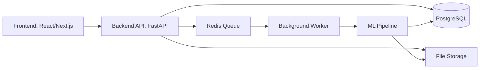

# SOC Anomaly Platform Architecture

## Цель

Веб-приложение для загрузки SIEM/NGFW-логов, запуска ML-анализа, поиска аномалий пользователей и хостов, explainability и формирования SOC-отчетов.

## Компоненты



## Backend modules

- `auth` — пользователи, роли, авторизация.
- `uploads` — загрузка и валидация файлов.
- `runs` — история запусков анализа.
- `anomalies` — найденные аномалии пользователей и хостов.
- `reports` — SOC-отчеты и экспорт.
- `metrics` — прокси-метрики качества модели.
- `core` — настройки, подключение к БД, общие зависимости.
- `workers` — фоновые задачи обработки данных.

## Main entities

### User

Пользователь системы.

Поля:
- `id`
- `email`
- `password_hash`
- `role`
- `created_at`

### UploadedFile

Загруженный лог-файл.

Поля:
- `id`
- `filename`
- `content_type`
- `size`
- `storage_path`
- `status`
- `uploaded_by`
- `created_at`

### AnalysisRun

Запуск анализа.

Поля:
- `id`
- `status`
- `scope`
- `target_date`
- `start_date`
- `end_date`
- `parameters`
- `created_by`
- `created_at`
- `finished_at`
- `error_message`

### Anomaly

Найденная аномалия.

Поля:
- `id`
- `run_id`
- `entity_type`
- `entity`
- `date`
- `severity`
- `score`
- `rank`
- `summary`
- `status`

### AnomalyExplanation

Объяснение аномалии.

Поля:
- `id`
- `anomaly_id`
- `feature_name`
- `feature_value`
- `baseline_value`
- `contribution`

### Report

SOC-отчет.

Поля:
- `id`
- `run_id`
- `format`
- `storage_path`
- `created_at`

## MVP stack

- Backend: FastAPI
- Frontend: React или Next.js
- Database: PostgreSQL
- Queue: Redis + RQ или Celery
- ML: pandas, scikit-learn
- Packaging: Poetry
- Local deploy: Docker Compose

## Analysis pipeline

Конвейер анализа реализован непосредственно в backend и не зависит от внешних
legacy-скриптов. Worker последовательно выполняет:

1. нормализацию загруженных SIEM- и PAN-логов с общей картой анонимизации;
2. выбор всех дат, входящих в заданный день, неделю, месяц или диапазон;
3. построение и preprocessing раздельных пользовательских и хостовых признаков;
4. полный скоринг Isolation Forest и Local Outlier Factor для каждой сущности;
5. explainability и сохранение полного распределения результатов;
6. расчет proxy-метрик и исследование устойчивости модели, если это предусмотрено режимом запуска;
7. агрегацию статистики и трендов за весь период;
8. создание графических, Markdown, PDF и SOC-отчетов;
9. сохранение manifest, конфигурации запуска и артефактов воспроизводимости.

## Application flow

1. Пользователь загружает файлы.
2. Backend сохраняет файлы и метаданные.
3. Пользователь запускает анализ.
4. Backend создает `AnalysisRun`.
5. Worker выполняет выбранный режим конвейера (`report`, `metrics`, `report+metrics`, `full` или `dry-run`).
6. Результаты всех сущностей сохраняются в БД и файловое хранилище.
7. После анализа автоматически формируются требуемые метрики и отчеты.
8. Frontend показывает аномалии, статистику, тренды, метрики и созданные артефакты.
9. Пользователь открывает карточку аномалии, контекст или отчет.

## Backend boundaries

Backend разделяет ответственность между слоями:

- **API layer** принимает HTTP-запросы и возвращает ответы.
- **Service layer** содержит бизнес-логику: запустить анализ, создать отчет, обработать файл.
- **Persistence layer** работает с БД.
- **Worker layer** выполняет долгие задачи вне HTTP-запроса.
- **ML layer** содержит переиспользуемую аналитику, которую можно вызвать из worker.

HTTP-запрос только валидирует параметры, создает или изменяет сущность и ставит
длительную операцию в очередь. Worker обновляет состояние запуска и каждого этапа,
а сервисы не зависят от FastAPI и могут тестироваться отдельно.

## Pipeline state model

Запуск анализа проходит этапы `import`, `features`, `scoring`, `explain` и
`reports`. Каждый этап хранит статус `pending`, `queued`, `running`, `completed`,
`failed` или `canceled`, время начала/окончания и безопасное описание ошибки.
Повторный запуск создает новую задачу для существующего запуска и не удаляет
историю предыдущей попытки.

Артефакты организованы по идентификатору запуска:

```text
data/runs/<run-id>/
├── features/
├── anomalies/
├── explanations/
├── metrics/
└── reports/
```

В БД сохраняются метаданные и относительные пути. Файлы отдаются только через API,
который проверяет права и не принимает произвольные пути от клиента.

## API modules

- `/uploads` — загрузка, проверка и нормализация входных файлов;
- `/runs` — создание, повторный запуск, прогресс и история анализа;
- `/anomalies` — поиск, фильтрация, карточка и workflow расследования;
- `/reports` — генерация, просмотр и скачивание отчетов;
- `/metrics` — прокси-метрики конкретного запуска;
- `/auth` и `/users` — сессия и управление пользователями;
- `/audit` — журнал критичных действий.

## Security and operations

Пароли хранятся только в виде адаптивного хеша. API использует короткоживущий JWT
и роли `admin`, `analyst`, `viewer`. Изменяющие операции и доступ к журналу
защищаются RBAC. Загрузки ограничиваются по расширению и размеру, имена файлов не
используются как пути хранения, а пользовательские ошибки не содержат traceback.

Локальный контур состоит из `backend`, `worker`, `postgres` и `redis`; миграции и
создание первого администратора выполняются отдельным init-процессом перед стартом
API. Каталоги загрузок и артефактов подключаются как volume.
