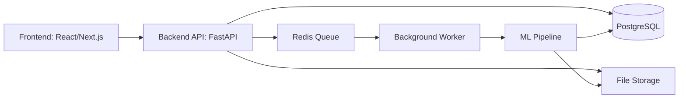

# SOC Anomaly Platform Architecture

## Цель

Веб-приложение для загрузки SIEM/NGFW-логов, запуска ML-анализа, поиска аномалий пользователей и хостов, explainability и формирования SOC-отчетов.

## Компоненты



## Backend modules

- `auth` — пользователи, роли, авторизация.
- `uploads` — загрузка и валидация файлов.
- `runs` — история запусков анализа.
- `anomalies` — найденные аномалии пользователей и хостов.
- `reports` — SOC-отчеты и экспорт.
- `metrics` — прокси-метрики качества модели.
- `core` — настройки, подключение к БД, общие зависимости.
- `workers` — фоновые задачи обработки данных.

## Main entities

### User

Пользователь системы.

Поля:
- `id`
- `email`
- `password_hash`
- `role`
- `created_at`

### UploadedFile

Загруженный лог-файл.

Поля:
- `id`
- `filename`
- `content_type`
- `size`
- `storage_path`
- `status`
- `uploaded_by`
- `created_at`

### AnalysisRun

Запуск анализа.

Поля:
- `id`
- `status`
- `scope`
- `target_date`
- `start_date`
- `end_date`
- `parameters`
- `created_by`
- `created_at`
- `finished_at`
- `error_message`

### Anomaly

Найденная аномалия.

Поля:
- `id`
- `run_id`
- `entity_type`
- `entity`
- `date`
- `severity`
- `score`
- `rank`
- `summary`
- `status`

### AnomalyExplanation

Объяснение аномалии.

Поля:
- `id`
- `anomaly_id`
- `feature_name`
- `feature_value`
- `baseline_value`
- `contribution`

### Report

SOC-отчет.

Поля:
- `id`
- `run_id`
- `format`
- `storage_path`
- `created_at`

## MVP stack

- Backend: FastAPI
- Frontend: React или Next.js
- Database: PostgreSQL
- Queue: Redis + RQ или Celery
- ML: pandas, scikit-learn
- Packaging: Poetry
- Local deploy: Docker Compose

## Migration path from current scripts

1. `python_script.py` -> сервис нормализации логов.
2. `build_features_v2.py` -> сервис построения признаков.
3. `preprocess_features.py` -> preprocessing service.
4. `train_anomaly_models.py` -> scoring service.
5. `explain_anomalies.py` -> explanation service.
6. `soc_report.py` -> report generation service.
7. `evaluate_proxy_metrics.py` -> metrics service.

## First MVP flow

1. Пользователь загружает файлы.
2. Backend сохраняет файлы и метаданные.
3. Пользователь запускает анализ.
4. Backend создает `AnalysisRun`.
5. Worker выполняет ML pipeline.
6. Результаты сохраняются в БД и файловое хранилище.
7. Frontend показывает список аномалий.
8. Пользователь открывает карточку аномалии и отчет.
```

Важная теория здесь: **backend не должен быть просто “папкой со скриптами”**. Хороший backend разделяет ответственность:

- **API layer** принимает HTTP-запросы и возвращает ответы.
- **Service layer** содержит бизнес-логику: запустить анализ, создать отчет, обработать файл.
- **Persistence layer** работает с БД.
- **Worker layer** выполняет долгие задачи вне HTTP-запроса.
- **ML layer** содержит переиспользуемую аналитику, которую можно вызвать из worker.

Для следующей задачи, **MYO-57: инициализировать backend на FastAPI**, это даст нам понятную структуру. Мы не будем хаотично складывать все в `main.py`.

Сделай сейчас `docs/architecture.md`, вставь черновик и пришли мне, что у тебя уже есть в `backend`: структура папок или вывод команды:
